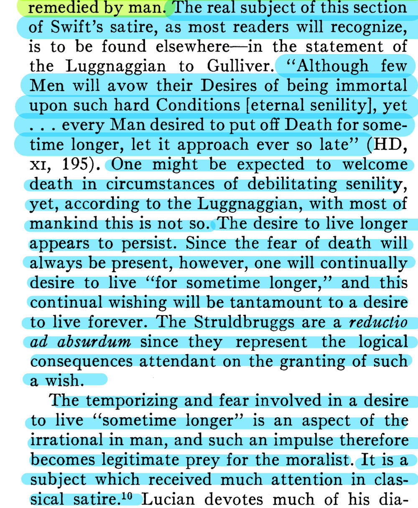
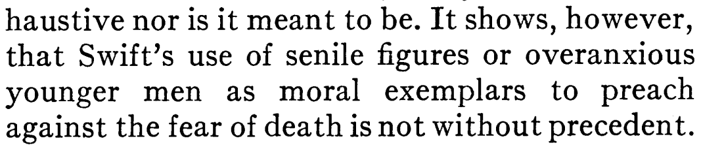
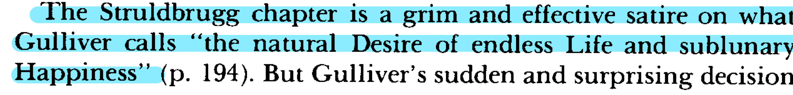
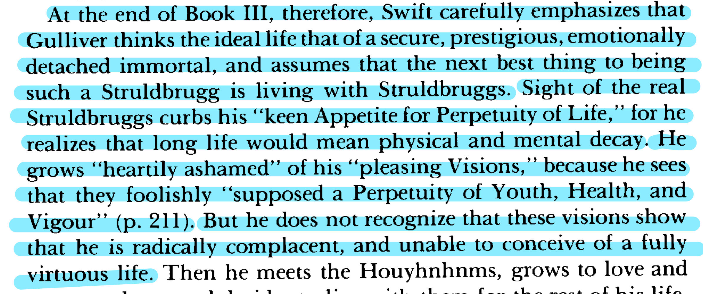

# Draft

## Part III, Chapter X of "Gulliver's Travels".

This chapter is about Gulliver's experiences in Luggnagg, particularly his encounter with the Struldbrugs, the immortals who never die but continue to age and have to suffer the infirmities of old age.

Initially, Gulliver reacts with envy and excitement at the idea of meeting people who never die, imagining the wisdom and experiences they must accumulate. However, he soon learns that the reality of their condition is far from enviable. Society views the Struldbruggs with a mixture of pity and horror.

### My thoughts

As Struldbruggs age, they become increasingly marginalized. They are perceived as useless and burdensome, emotionally disconnected, and intellectually disengaged from the world around them.

Immortality, in this part, is a curse rather than a gift, especially considering the physical and emotional pains that come with endless aging.

The existence of Struldbruggs challenges the ideal concept of immortality, revealing that even immortality cannot bring happiness and satisfaction, but instead brings more pain and isolation.

《盗梦空间》中，无限梦境提供了一种逃避现实的方式，人们可以在无限梦境中构建理想的世界，控制一切，但一直生活在这样的梦中，也有可能使人失去对现实的感知和参与。An old man, filled with regret, waiting to die alone.

# Summary

格列佛访问了Luggnagg王国。在这里，他发现了一种被称为Struldbruggs的特殊群体，这些人拥有永生不死的能力。起初，格列佛对这种永生充满了向往和好奇，想象了很多如果他不死，他能做的事情
然而，随着对Struldbruggs的了解加深，格列佛逐渐意识到这种永生并非他想象中的那样。尽管Struldbruggs不会死亡，但他们仍然会老去，而且随着年龄的增长，他们的健康和精神状态会持续恶化，最终变得非常痛苦和悲惨。他们被视为社会的负担，甚至在某种程度上被社会排斥和忽视。

# Structure

你的中心论点“永生未必是件好事，因为

(1).当他们活到九十岁时，食欲不振、病痛缠身、记忆衰退，连亲友的名字都忘记了，因此甚至失去了唯一的娱乐活动——读书。

(2).由于语言不断变化，当他们老到一定程度时，他们听不懂其他人说的话，因此像外国人一样生活不变。

(3).三十岁以后他们不断忧郁、沮丧起来，一天天加深。当他们八十岁的时候，他们不仅拥有一般的老年人的缺点，甚至还有许多别的缺点，不但性情顽固、暴躁，还不讲友谊和情爱。

(4).他们嫉妒年轻人，因为他们觉得自己没有寻欢作乐的可能。他们甚至羡慕老年人的死亡，因为只有别人才能得到安息，而他们自己却永远没有希望得到。

(5).这样的“老古董”被其他人轻视、痛恨，甚至认为他们是不祥之兆。

# J. Leeds Barroll's "Gulliver and the Struldbruggs"

## Main Arguments of the Essay:

1. **Fear of old Age and Death:**

* Mere loathing for the physical facts of old age. Senility is unattractive to people. A horrifying picture of senility.

2. **Moral and political satire:**

# **"The Struldbruggs, and Houyhnhnms, and the Good Life"**

## Main Arguments of the Essay:

